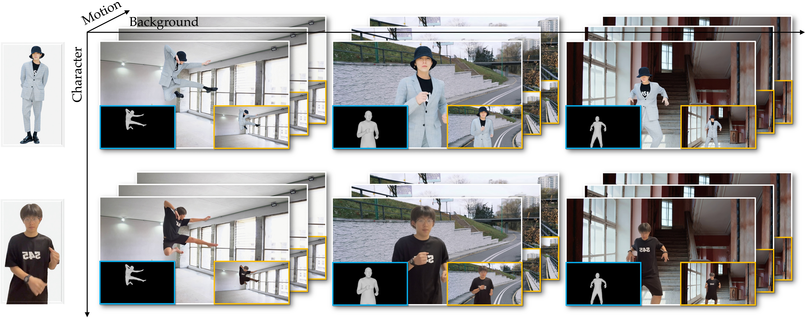

  <h2>AniCrafter: Customizing Realistic Human-Centric Animation via Avatar-Background Conditioning in Video Diffusion Models </h2>

    <a href='https://myniuuu.github.io/' target='_blank'>Muyao Niu</a> 1,2 &nbsp;
    <a href='' target='_blank'>Mingdeng Cao</a>1 &nbsp;
    <a href='' target='_blank'>Yinfan Zhan</a>1 &nbsp;
    <a href='' target='_blank'>Qingtian Zhu</a>1 &nbsp; 
    <a href='' target='_blank'>Mingze Ma</a>1 &nbsp;
    <a href='' target='_blank'>Jiancheng Zhao</a>1 &nbsp; 

    <a href='' target='_blank'>Yanhong Zeng</a>2 &nbsp; 
    <a href='' target='_blank'>Zhihang Zhong</a>2 &nbsp; 
    <a href='' target='_blank'>Xiao Sun</a>2 &nbsp; 
    <a href='' target='_blank'>Yinqiang Zheng</a>1 &nbsp; 

    1 The University of Tokyo &nbsp; 2 Shanghai Artificial Intelligence Laboratory &nbsp; * Corresponding Authors &nbsp; 

  <h3>
    
  </h3>

----

Click 'watch' instead of 'star' to get the notifications when we update and release the code and model.

We will release code and model by 2025.07.01.